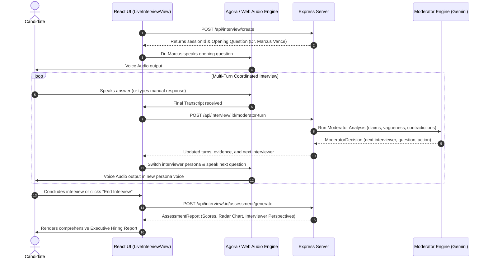

# PanelAI: Coordinated AI Interview Panel
## Project Brief, Architecture, Workflow & Teammate Hand-off Guide

---

## 1. Executive Summary & Project Brief

**PanelAI** is an adaptive, real-time, voice-first interview simulation and evaluation platform. Unlike standard single-agent interview bots that ask linear, generic questions, PanelAI coordinates a **multi-persona AI interview panel** that dynamically shares a single evolving knowledge and evidence graph about the candidate in real time.

### Core Value Proposition:
1. **Multi-Persona Coordination**: Simulates a realistic hiring panel (Technical Architect, Product Lead, Engineering Director/Behavioral, VP of Engineering/Executive, and Enterprise Client Stakeholder).
2. **Dynamic Turn-by-Turn Orchestration**: The Central Moderator Engine analyzes candidate answers on the fly, calculating vagueness, detecting contradictions with earlier statements, extracting concrete claims/metrics, and deciding which panelist should speak next or challenge the candidate.
3. **Voice-First Experience with Interruption Handling**: Candidate and AI panelists interact via bidirectional voice powered by Agora WebRTC and browser SpeechSynthesis/SpeechRecognition with echo cancellation and natural interruption detection.
4. **Comprehensive Hiring Committee Report**: Generates an executive hiring assessment with competency radar charts, rubric scores, evidence quotes, timestamps, and individual perspectives from each interviewer.

---

## 2. System Architecture & Tech Stack

```mermaid
graph TD
    Client["Client (React 19 + Vite + Tailwind CSS)"]
    Server["Server (Express + TypeScript + TSX)"]
    Gemini["Google Gemini API (gemini-2.5-flash)"]
    Agora["Agora RTC / Conversational AI Engine"]
    Moderator["Moderator Engine (Multi-Agent Orchestration)"]
    Assessment["Assessment Engine (Hiring Committee Scoring)"]

    Client <-->|WebRTC Voice & Transcripts| Agora
    Client <-->|REST APIs (/api/interview/*)| Server
    Server --> Moderator
    Moderator -->|Semantic Analysis & Next Action| Gemini
    Moderator -.->|Deterministic Fallback Engine| Server
    Server --> Assessment
```

### Technology Stack:
- **Frontend**: React 19, TypeScript, Vite 6, Tailwind CSS 4, Lucide Icons, Motion.
- **Backend / API**: Node.js, Express, `tsx` (runtime TypeScript execution).
- **AI Intelligence**: `@google/genai` (Gemini 2.5 Flash), structured JSON response schemas, deterministic fallback rule engine.
- **Real-Time Voice / WebRTC**: Agora RTC SDK (`agora-rtc-sdk-ng`), Web Audio API (`AudioContext`, `AnalyserNode`), Web Speech API (`SpeechRecognition`, `SpeechSynthesis`).

---

## 3. The 5 AI Interviewer Personas

Located in [`src/lib/personas.ts`](file:///d:/Projects/Confluence%20AI/panelai---coordinated-ai-interview-panel/src/lib/personas.ts):

| Persona | Role | Focus Areas | Questioning Strategy |
| :--- | :--- | :--- | :--- |
| **Dr. Marcus Vance** | `technical` (Lead Architect) | Distributed Systems, Latency, Concurrency, Caching, DB Scalability | Starts with high-level architecture, drills into edge cases, replication lag, and failure modes. |
| **Elena Rostova** | `product` (Head of Product) | Customer Experience, Business Metrics, KPIs, Feature Prioritization | Probes how engineering wins translate into user retention, conversion, and business impact. |
| **Devon Clark** | `behavioral` (Engineering Ops) | Conflict Resolution, Production Outages, Team Ownership, Mentorship | Evaluates authentic experiences vs PR answers using STAR framework probing. |
| **Sarah Jenkins** | `hiring_manager` (VP of Engineering) | Executive Leverage, Tech Debt, Strategic Vision, Org Fit | Assesses 30,000-ft strategic thinking, build vs buy decisions, and high-velocity engineering culture. |
| **Arthur Pendelton** | `customer` (Client Stakeholder) | Escalation Handling, Non-Technical Explanations, SLA Trust | Simulates live customer outages where the candidate must explain problems without jargon. |

---

## 4. End-to-End Interview Workflow



---

## 5. Repository Structure & Key Files

```
panelai---coordinated-ai-interview-panel/
├── package.json                 # Dependencies & scripts
├── server.ts                    # Backend API endpoints & Vite middleware integration
├── vite.config.ts               # Vite configuration & path aliases
├── index.html                   # HTML SPA template
├── src/
│   ├── App.tsx                  # Main router & top-level view state manager
│   ├── index.css                # Global styles & Tailwind configuration
│   ├── components/
│   │   ├── VoiceOrb.tsx         # Animated 3D/canvas voice pulsation & state visualizer
│   │   ├── InterviewerPanel.tsx # Left sidebar showing active and completed personas
│   │   ├── LiveTranscript.tsx   # Live scrolling conversation turns & partial speech
│   │   ├── EvidenceGraphCard.tsx# Real-time competency evidence & vagueness meter
│   │   ├── DebugPanel.tsx       # Live telemetry and multi-agent decision drawer
│   │   ├── RadarChart.tsx       # 5-axis competency evaluation chart
│   │   └── Navbar.tsx           # Navigation header
│   ├── lib/
│   │   ├── personas.ts          # Persona definitions, rubric weights, and voice profiles
│   │   ├── moderatorEngine.ts   # Core AI orchestration, Gemini prompts & fallback engine
│   │   ├── assessmentEngine.ts  # Post-interview evaluation & hiring committee synthesis
│   │   ├── demoData.ts          # Seed data for candidates, sample jobs, and reports
│   │   ├── resumeParser.ts      # Parser for uploaded candidate resumes
│   │   └── agora/
│   │       ├── agoraClient.ts   # Frontend WebRTC, SpeechSynthesis & mic volume analyzer
│   │       └── agoraService.ts  # Backend Agora token generation & AI Agent invitations
│   ├── types/
│   │   └── interview.ts         # TypeScript interfaces (InterviewTurn, EvidenceItem, ModeratorDecision, etc.)
│   └── views/
│       ├── LandingView.tsx      # Homepage with feature showcases and demo CTA
│       ├── InterviewSetupView.tsx# Configuration before starting the interview
│       ├── LiveInterviewView.tsx# The active interview cockpit
│       ├── AssessmentReportView.tsx# Final executive hiring decision report
│       ├── JobManagementView.tsx# Job description and competency configurator
│       ├── CandidateDashboardView.tsx# Candidate interview history & practice hub
│       └── AdminDashboardView.tsx# Analytics and evaluation telemetry
```

---

## 6. How to Run Locally

### Prerequisites:
- Node.js (v18+ recommended)
- Windows / macOS / Linux

### Installation & Startup:
```bash
# 1. Navigate to the panelai directory
cd "panelai---coordinated-ai-interview-panel"

# 2. Install dependencies (on Windows PowerShell, use npm.cmd)
npm install

# 3. Start development server
npm run dev
```

The application will be accessible at: **`http://localhost:3000`**

### Scripts:
- `npm run dev`: Runs `tsx server.ts` (Vite dev server + Express backend simultaneously).
- `npm run lint`: Runs `tsc --noEmit` to verify type safety across the entire codebase.
- `npm run build`: Bundles the Vite frontend and compiles the backend into `dist/`.
- `npm start`: Runs the production server from `dist/`.

---

## 7. Environment Variables Configuration

Create a `.env` file in `panelai---coordinated-ai-interview-panel/` if you want to enable live cloud AI and WebRTC:

```ini
# Google Gemini API Key (Enables real-time dynamic LLM moderator decisions)
GEMINI_API_KEY="your_gemini_api_key_here"

# Agora WebRTC Credentials (Optional: enables cloud-hosted Agora voice streaming)
NEXT_PUBLIC_AGORA_APP_ID="your_agora_app_id"
NEXT_AGORA_APP_CERTIFICATE="your_agora_app_certificate"
AGORA_CUSTOMER_ID="your_agora_customer_id"
AGORA_CUSTOMER_SECRET="your_agora_customer_secret"

# Agent & Demo Mode Flags
NEXT_PUBLIC_AGENT_UID="333"
NEXT_PUBLIC_DEBUG_MODE="false"
NEXT_PUBLIC_DEMO_MODE="false"
```

> [!NOTE]
> If `GEMINI_API_KEY` or Agora credentials are not provided, the application **automatically uses its offline deterministic fallback engine and browser Web Speech APIs**, allowing full functionality without paid keys.

---

## 8. Key Solved Issues & Technical Caveats for Teammates

### 1. Browser Speech Synthesis Cutoff (Fixed)
- **What Happened**: In Chromium browsers, `window.speechSynthesis` can garbage-collect long utterances midway, causing the interviewer's voice to abruptly stop. Also, computer speaker output can feed into the microphone, falsely triggering voice interruption.
- **Solution in [`agoraClient.ts`](file:///d:/Projects/Confluence%20AI/panelai---coordinated-ai-interview-panel/src/lib/agora/agoraClient.ts)**:
  - Attached persistent reference to `window.__currentUtterance`.
  - Added a 2-second grace period at the start of agent speech.
  - Implemented a sustained volume filter (`> 60` for 4+ frames) so ambient speaker audio doesn't cancel voice synthesis.

### 2. Interviewer Progression & Repetition Prevention (Fixed)
- **What Happened**: A static check on `turnIndex >= 6` in the fallback engine caused Sarah Jenkins to repeat the exact same question in an infinite loop.
- **Solution in [`moderatorEngine.ts`](file:///d:/Projects/Confluence%20AI/panelai---coordinated-ai-interview-panel/src/lib/moderatorEngine.ts)**:
  - Session-level `askedQuestions` set ensures **no question is ever repeated**.
  - Structured progression moves through **Marcus $\rightarrow$ Elena $\rightarrow$ Devon $\rightarrow$ Sarah $\rightarrow$ Conclude**.
  - Gemini model call was corrected to `"gemini-2.5-flash"`.

---

## 9. Quick Demo Walkthrough for Judges / Testing

When demonstrating the platform:
1. Open **[http://localhost:3000](http://localhost:3000)** $\rightarrow$ Click **Start Live Panel Interview**.
2. Dr. Marcus Vance begins by asking for a distributed system design.
3. In the center cockpit, use the **Judge Demonstration Presets**:
   - Click **`1. Deep Tech Answer`**: Candidate gives a high-detail caching answer.
   - Observe the live transition to **Elena Rostova (Product)** asking about customer impact.
   - Submit an answer about customer metrics $\rightarrow$ transitions to **Devon Clark (Behavioral)**.
   - Submit a team collaboration answer $\rightarrow$ transitions to **Sarah Jenkins (VP of Engineering)**.
   - Complete the panel $\rightarrow$ Click **Complete Interview & View Report** to inspect the radar chart, rubric breakdown, and executive recommendation.
